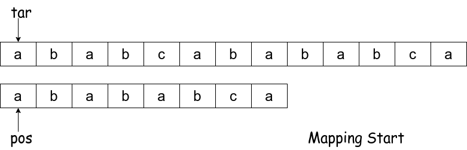
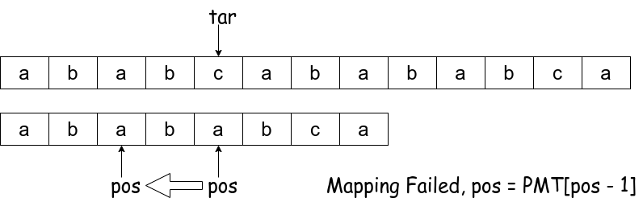
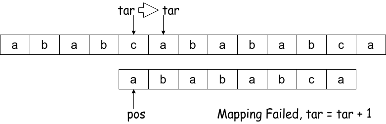
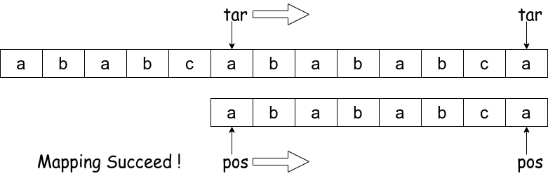
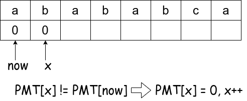
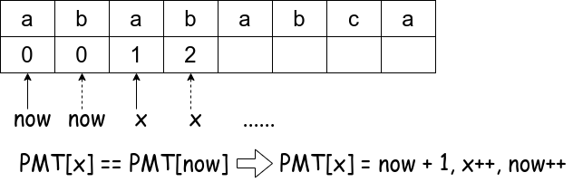
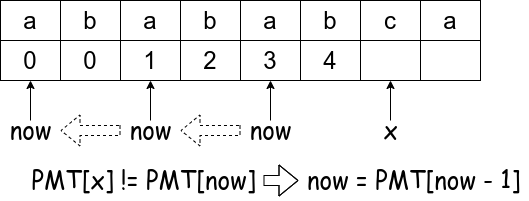
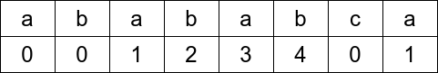

# KMP 算法详解

KMP 算法是一个十分高效的字符串查找算法，目的是在一个字符串 ```s``` 中，查询 ```s``` 是否包含子字符串 ```p```，若包含，则返回 ```p``` 在 ```s``` 中起点的下标。

KMP 算法全称为 Knuth-Morris-Pratt 算法，由 Knuth 和 Pratt 在1974年构思，同年 Morris 也独立地设计出该算法，最终由三人于1977年联合发表。

举一个简单的例子，在字符串 ```s = ababcabababca``` 中查找子字符串 ```p = abababca```，如果暴力查找，我们会遍历 ```s``` 中的每一个字符，若 ```s[i] = p[0]```，则向后查询 ```p.length() 
``` 位是否都相等。这种朴素的暴力的算法复杂度为 $O(m \times n)$，其中 $m$ 和 $n$ 分别是 ```p``` 和 ```s``` 的长度。

KMP 算法可以方便地简化这一查询的时间复杂度，达到 $O(m + n)$。

## 1. PMT 序列

PMT 序列是 KMP 算法的核心，即 Partial Match Table（部分匹配表）。举个例子：

|   char    | a | b | a | b | a | b | c | a |
|-----------|---|---|---|---|---|---|---|---|
|```index```| 0 | 1 | 2 | 3 | 4 | 5 | 6 | 7 |
| ```PMT``` | 0 | 0 | 1 | 2 | 3 | 4 | 0 | 1 |

**PMT 的值是字符串的前缀集合与后缀集合的交集中最长元素的长度。**

* ```PMT[0] = 0```: 字符串 ```a``` 既没有前缀，也没有后缀；
* ```PMT[1] = 0```: 字符串 ```ab``` 前缀集合为 ```{a}```，后缀集合为 ```{b}```，没有交集；
* ```PMT[2] = 1```: 字符串 ```aba``` 前缀集合为 ```{a, ab}```，后缀集合为 ```{ba, a}```，交集为 ```{a}```，交集元素的最长长度为1；
* ```PMT[3] = 2```: 字符串 ```abab``` 前缀集合为 ```{a, ab, aba}```，后缀集合为 ```{bab, ab, b}```，交集为 ```{ab}```，交集元素的最长长度为2；
* …… 以此类推。

## 2. 算法主体

现在我们已经知道了 PMT 序列的含义，那么假设在 PMT 序列已经给定的情况下，如何加速字符串匹配算法？

1. ```tar``` 存储 ```s``` 的下标，从 0 开始，若 ```tar > s.length() - 1```， 代表匹配失败；
2. ```pos``` 存储 ```p``` 的下标，从 0 开始，若 ```s[tar] != p[pos]```，则 ```pos``` 走到**下一个可能匹配的位置**。

Step 1:



Step 2:



Step 3:



Step 4:



```c
/**
 * @brief KMP algorithm: A string-searching algorithm.
 * 
 * @param s Source string.
 * @param p Search pattern.
 * @return int The first index of s's substring, which equals to p. If not found, return -1.
 */
int KMP(string s, string p) {
    int tar = 0;                    /** Index of source string s */
    int pos = 0;                    /** Index of pattern string p */

    vector<int> PMT = genPMT(p);    /** Pattern p's PMT sequence */

    while(tar < s.length()) {
        if(s[tar] == p[pos]) {      /** If s[tar] == p[pos], go step forward */
            tar++;
            pos++;
        }
        else if(pos)                /** Failed map, go to the last map index of p */
            pos = PMT[pos - 1];
        else                        /** pos[0] failed map, go to the next s's index */
            tar++;

        if(pos == p.length())       /** Mapping success */
            return tar - pos;
    }
}
```

## 3. 生成 PMT 序列

快速生成 PMT 序列，是 KMP 算法的精髓所在，其核心思想是 **自己与自己做匹配**。

Step 1:



Step 2:



Step 3:



Step 4:



```c
/**
 * @brief KMP algorithm: Generate PMT sequence.
 * 
 * @param p Search pattern.
 * @return vector<int> PMT sequence.
 */
vector<int> genPMT(string p) {
    vector<int> PMT{ 0 };       /** PMT[0] = 0 always stand up. */
    int x = 1;                  /** Index of pattern string */
    int now = 0;

    while(x < p.length()) {
        if(p[now] == p[x]) {    /** If p[now] == p[x], go step forward */
            now++;
            x++;
            PMT.push_back(now);
        }
        else if(now)            /** Failed map, go to the last map index of p */
            now = PMT[now - 1];
        else {                  /** p[0] failed map, no intersection */
            PMT.push_back(0);
            x++;
        }
    }
    return PMT;
}
```